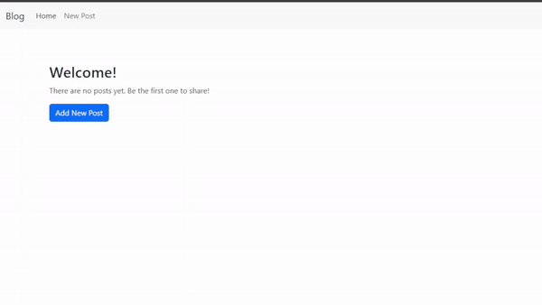

# First Django Project - Blog

## Introduction

This is a simple blog project created using Django. It has the following features:

- Home page that lists all the blog posts
- Detail page for each blog post
- Create, update and delete blog posts

## Requirements

- Python 3.6+
- Django 5.0+

## Installation

1. Clone the repository

   ```bash
   git clone https://github.com/asmaahamid02/first-django-project-blog
   ```

2. Install the requirements

   ```bash
   pip install -r requirements.txt
   ```

3. Run the migrations

   ```bash
   python manage.py migrate
   ```

4. Run the development server

   ```bash
   python manage.py runserver
   ```

## Usage

- Visit the home page to see all the blog posts
- Click on a blog post to view the detail page
- Create a new blog post by visiting `/post/add/`
- Update a blog post by visiting `/post/<id>/update/`
- Delete a blog post by visiting `/post/<id>/delete/`

## Demo


